
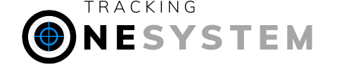

Welding tracking system software with adaptable, dynamic, easy, fast and multi-platform support for welded manufacturing companies.

For a more detailed introduction, please visit our website.

Website: [onesytem.app](https://onesytem.app)

#### -Dependencies
- Flutter/Dart
- Kotlin
- Swift
- Javascript
- Python/Django
- MySQL

          

## Getting Started

### - Login Page
- Mysql was used as database.
- If the user checks the remember me option when logging in, the information will be saved in the local database. It will be transferred directly to the main screen at the next login.
- And more...

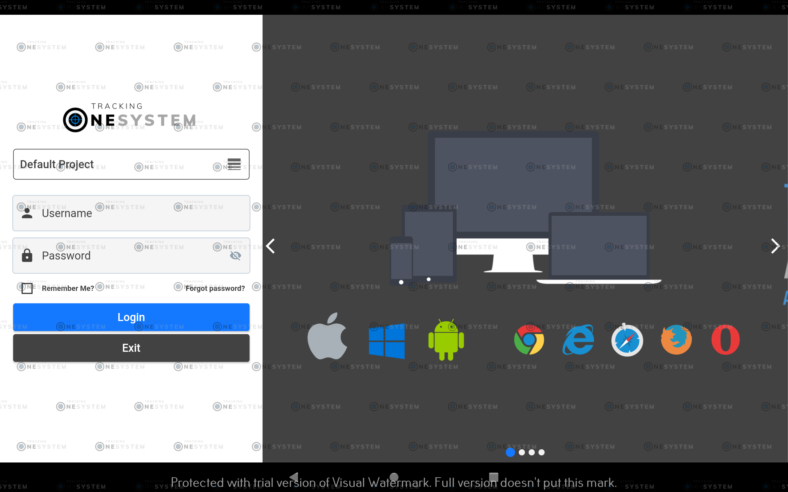

### - Main Page
- Querying and viewing isometric information.
- View isometry drawing as pdf file.
- View and download reports for the spool or weld joints.
- Dark mode support in all pages.
- And more...

##### -- Theme Mode (Light/Dark)
       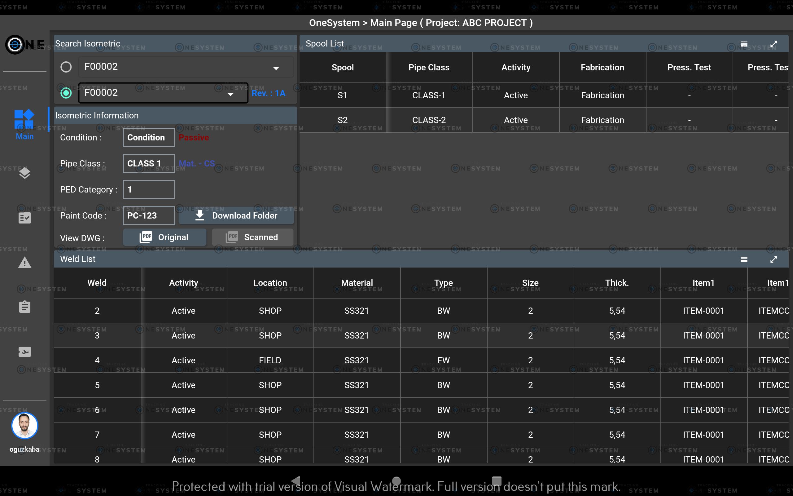

##### -- Expand Gridview
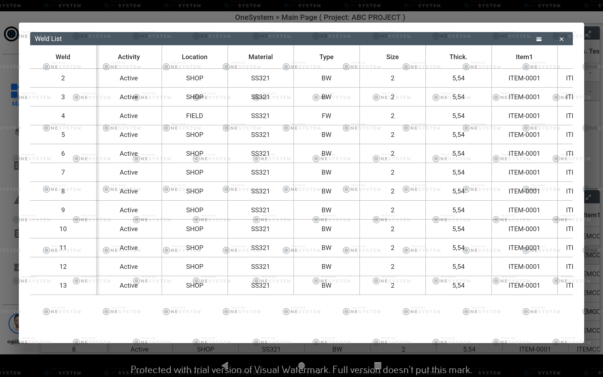

### - PDFViewer Page
- Pdf viewing screen to view isometric drawing files.
- Zoom , scroll , bookmark feature etc.

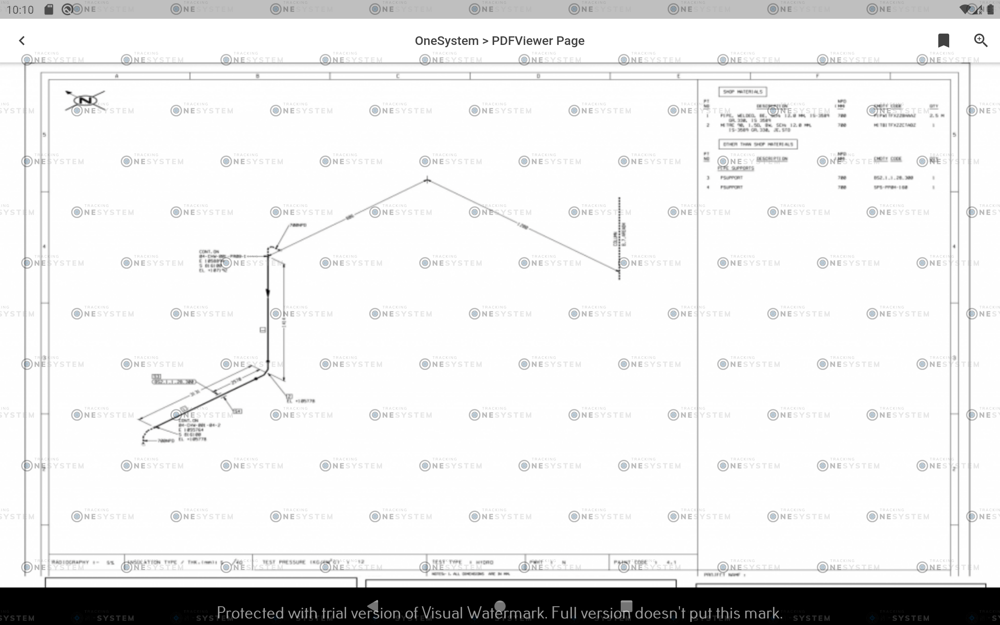

### - Approval Page
- Weld and FitUp confirmation screens.
- For data entry and approval by the quality department.
- Drag-Drop support.

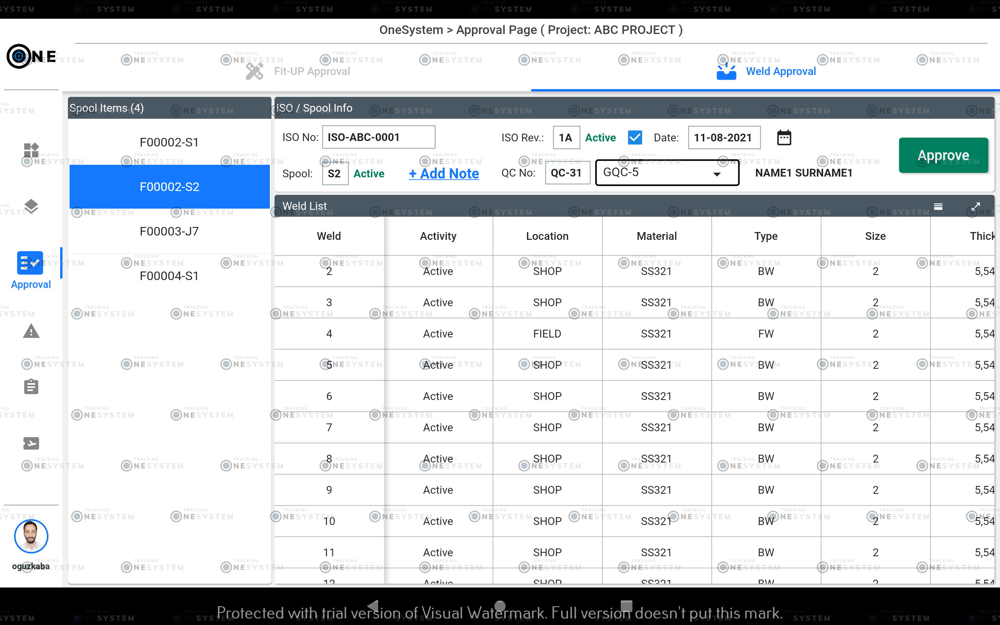       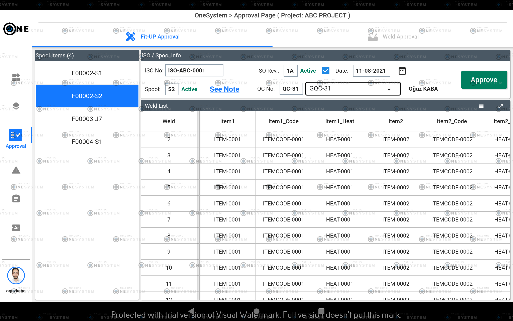
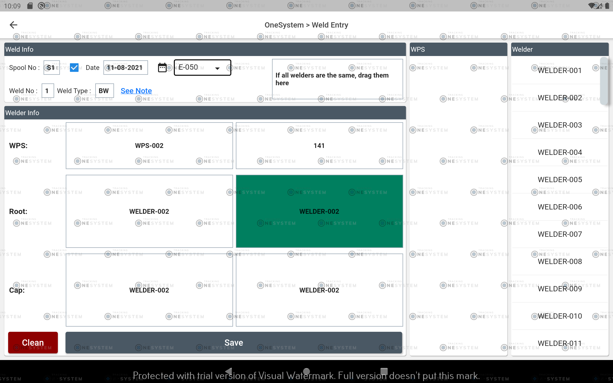

### - Note Screen
- Note screen to report problems.
- User control based.
- Add Note...
- Existing note will be displayed automatically...

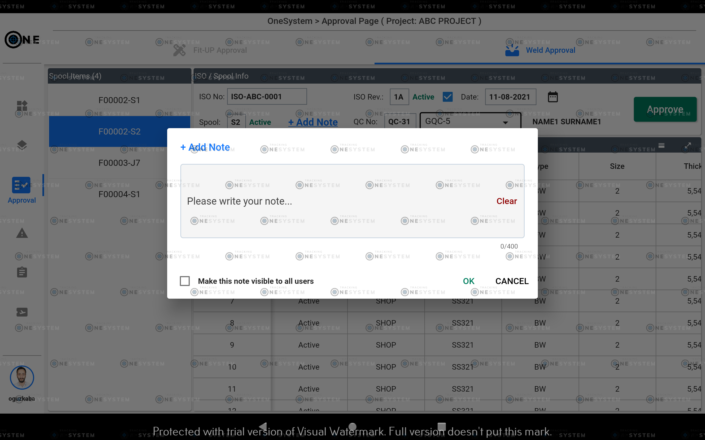       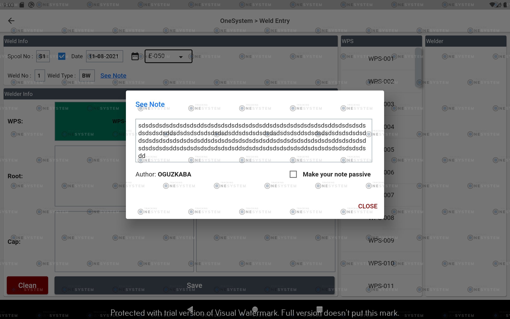

### - Settings Page
- View profile information.
- Change profile picture.
- Change theme mode (Light/Dark/System*)
- More options will be added...

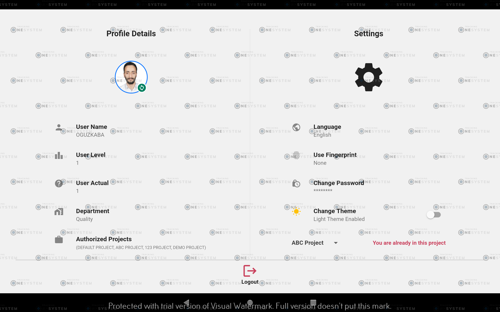

#### - Settings Page -> Change Project
- Change project while app is in use.

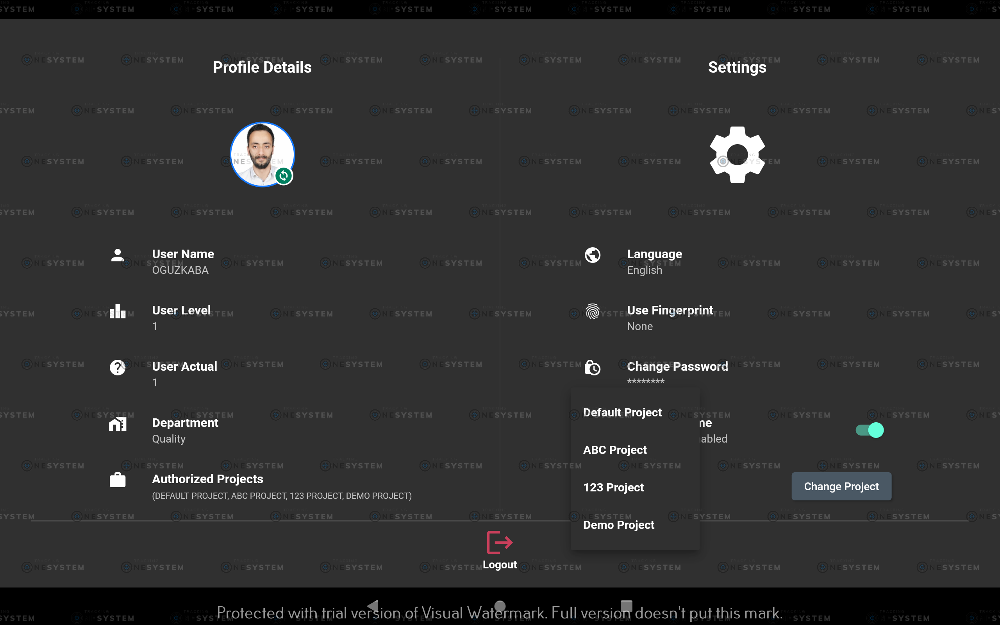

## Get The Demo Application
      

## Support And Feedback
For support and feedback, you can contact us via email. Thank you.
> Email: [oguz-kaba@hotmail.com](mailto:oguz-kaba@hotmail.com)

## License
[MIT](./LICENSE)

Coded by [oguzkaba](https://github.com/oguzkaba)
